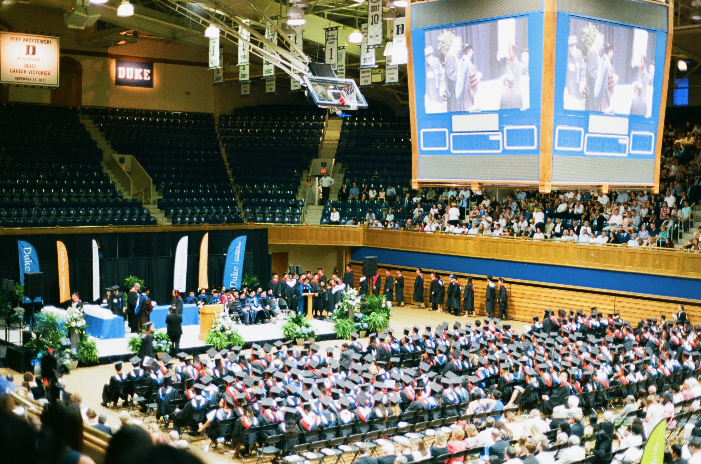

## Bio

I am a 4th year **Ph.D. student in the Computer Science department at the Johns Hopkins University** in Baltimore, Maryland. I work with Prof. Gregory Hager on vision-based robotics control and Prof. Mathias Unberath on medical imaging. I completed my undergraduate program at the Duke University in Durham, North Carolina with double major in Computer Science & Statistics and worked with Prof. Lawrence Carin in deep generative models.  

Between grad school and college graduation, I worked at Mckinsey & Company as Business Analyst in Greater China Region, focused on TMT related strategy consulting. During undergrad, I also did a software enginnering internship at Facebook and a research internship at UC Berkeley with Prof. Dawn Song and Prof. Bo Li.

### Works in computer vision, reinforcement learning and robotics

1. **VIHE: Transformer-Based 3D Object Manipulation Using Virtual In-Hand View**
_Weiyao Wang_ , Yutian Lei, Shiyu Jin, Gregory D. Hager and Liangjun Zhang.
_In submission_. [[Project Site](https://vihe-3d.github.io)]

1. **RegCLR: A Self-Supervised Framework for Tabular Representation Learning in the Wild**
_Weiyao Wang_, Byung-Hak Kim and Varun Ganapathi.
_Oral presentation in Table Representation Learning Workshop, NeurIPS 2023_. [Talk](https://slideslive.com/38996604/regclr-a-selfsupervised-framework-for-tabular-representation-learning-in-the-wild)

1. **Dynamical Scene Representation and Control with Keypoint-Conditioned Neural Radiance Field**
_Weiyao Wang_, Andrew S. Morgan, Aaron M. Dollar, Gregory D. Hager
_CASE 2022_. [Paper](arxiv.org/pdf/2110.08239)

1. **Learn Proportional Derivative Controllable Latent Space from Pixels**
_Weiyao Wang_ , Marin Kobilarov, and Gregory D. Hager.
_CASE 2022_. [Paper](arxiv.org/pdf/2110.08239)

1. **How You Act Tells a Lot: Privacy-Leaking Attack on Deep Reinforcement Learning**
Xinlei Pan*, _Weiyao Wang_* , Xiaoshuai Zhang*, Bo Li, Jinfeng Yi, and Dawn Song.
_Appearing in AAMAS, 2019_. [Paper](arxiv.org/abs/1904.11082)

### Works in deep generative models 

1. **JointGAN: Multi-Domain Joint Distribution Learning with Generative Adversarial Nets**
Yunchen Pu, Shuyang Dai, Zhe Gan, _Weiyao Wang_, Guoyin Wang, Yizhe Zhang, Ricardo Henao, Lawrence Carin.
_Appearing in ICML, 2018_. [Paper](arxiv.org/abs/1806.02978)

1. **Adversarial symmetric variational autoencoder**
Yuchen Pu, _Weiyao Wang_, Ricardo Henao, Liqun Chen, Zhe Gan, Chunyuan Li, Lawrence Carin.
_Appearing in NeuralPS, 2017_. [Paper](papers.nips.cc/paper/7020-adversarial-symmetric-variational-autoencoder)

1. **Triangle generative adversarial networks**
Zhe Gan, Liqun Chen, _Weiyao Wang_, Yuchen Pu, Yizhe Zhang, Lawrence Carin.
_Appearing in NeuralPS, 2017_. [Paper](papers.nips.cc/paper/7109-triangle-generative-adversarial-networks)

