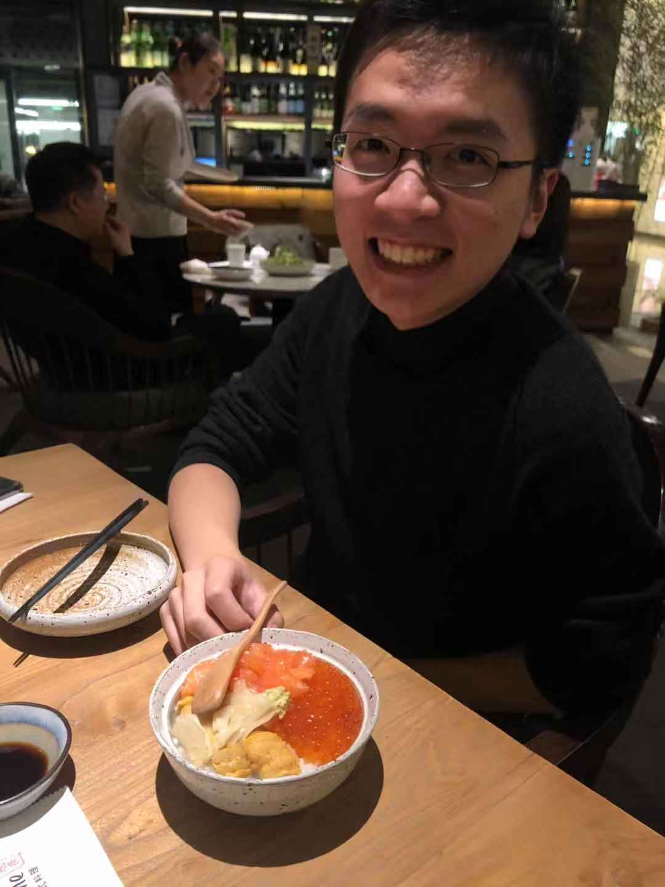

## Weiyao Wang

I am a PhD student in the Computer Science department at the Johns Hopkins University in Baltimore, Maryland. I work with Professor Gregory Hager on reinforcement learning for robotics control and Professor Mathias Unberath on computer vision for medical application. I completed my undergraduate degree at the Duke University in Durham, North Carolina with major in Computer Science and Statistics and worked with Professor Lawrence Carin in deep generative models.  Between PhD and undergrad, I worked at Mckinsey & Company as business analyst in Greater China Region, focused on TMT related strategy/management consulting. 

### Works in deep reinforcement learning

#### How You Act Tells a Lot: Privacy-Leaking Attack on Deep Reinforcement Learning
Xinlei Pan*, Weiyao Wang*, Xiaoshuai Zhang*, Bo Li, Jinfeng Yi, and Dawn Song.
Accepted by the AAMAS, 2019. 

### Works in deep generative models 

#### JointGAN: Multi-Domain Joint Distribution Learning with Generative Adversarial Nets
Yunchen Pu, Shuyang Dai, Zhe Gan, Weiyao Wang, Guoyin Wang, Yizhe Zhang, Ricardo Henao, Lawrence Carin
Accepted by ICML, 2018. 

#### Adversarial symmetric variational autoencoder
Yuchen Pu, Weiyao Wang, Ricardo Henao, Liqun Chen, Zhe Gan, Chunyuan Li, Lawrence Carin
Accepted by NeuralPS, 2017. 

#### Triangle generative adversarial networks
Zhe Gan, Liqun Chen, Weiyao Wang, Yuchen Pu, Yizhe Zhang, Lawrence Carin
Accepted by NeuralPS, 2017. 

